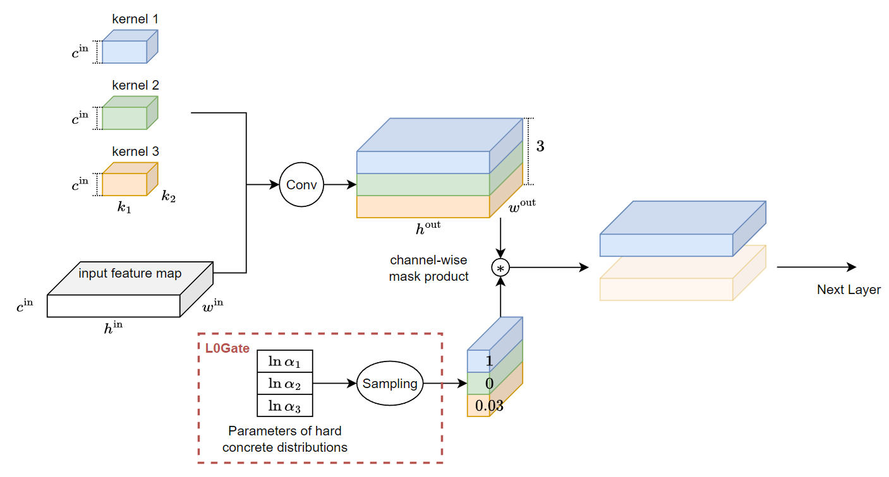
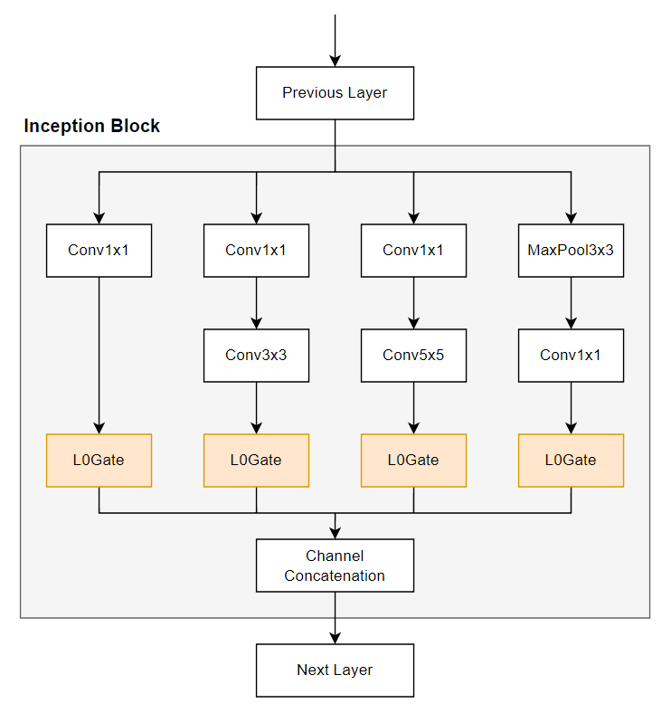
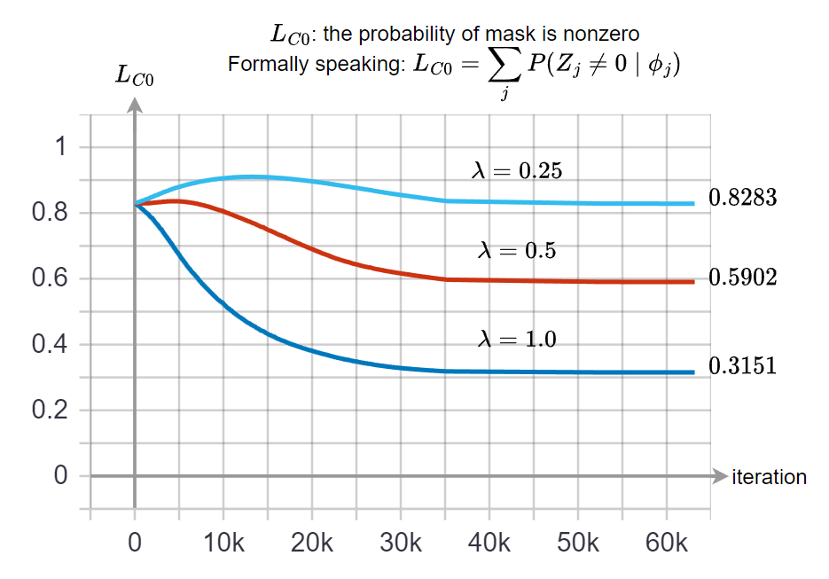

**TODO:**

- [ ] coding the computation cost (FLOPS)
- [x] coding the sparsity (model size reduction)
- [x] report the results that shows the pruning benifits, e.g.: same test accuracy but with lower computation cost
- [ ] analize the pruning parameters, $\ln\alpha$
- [x] check the version of hydra, pytorch, lightning ...

Apply L0 regularization ([Learning Sparse Neural Networks through L0 Regularization](https://arxiv.org/abs/1712.01312)) on CIFAR10 image classification task with GoogleNet model.

The class of L0 gate layer, `sparsereg.model.basic_l0_blocks.L0Gate`, is modified from the author's [repo](https://github.com/AMLab-Amsterdam/L0_regularization/tree/39a5fe68062c9b8540dba732339c1f5def451f1b).
Also, the CIFAR10 training part including model structure and dataloader are modified from [TUTORIAL 4: INCEPTION, RESNET AND DENSENET](https://pytorch-lightning.readthedocs.io/en/latest/notebooks/course_UvA-DL/04-inception-resnet-densenet.html). I just refactored into [hydra](https://hydra.cc/docs/intro/) and [lightning](https://pytorch-lightning.readthedocs.io/en/latest/)(my style) format.

# Introduction to L0 Regularization

## Motivation
Let $\theta$ be the parameters of our model, and we hope there is only a small number of non-zero parameters.
Zero-norm measures this number so the L0 regularization term, $\mathcal{L}_{C0}$, can be defined as:

```math
\mathcal{L}_{C0}(\theta)=\|\theta\|_0=\sum_{j=1}^{|\theta|}\mathbb{I}[\theta_j\neq0]
```

Combined with entropy loss, $\mathcal{L}_E$, forms the final loss $\mathcal{L}$:

```math
\mathcal{L}_E(\theta)=\frac{1}{N}\left(
\sum_{i=1}^N\mathcal{L}(NN(x_i;\theta),y_i)
\right) \\
\mathcal{L}(\theta)=\mathcal{L}_E(\theta)+\lambda\mathcal{L}_{C0}(\theta)
```

However, L0 regularization term is not differentiable. To cope with this issue, we apply a mask random variable $Z=\{Z_1,...,Z_{|\theta|}\}$ which each $Z_i$ follows a Bernoulli distribution with parameter $q_i$.

Therefore, we can rewrite $\mathcal{L}_{C0}$ in a closed form:

$$
\begin{align}
\mathcal{L}_{C0}(\theta, q)=\mathbb{E}_{Z\sim\text{Bernoulli}(q)}\left[
\sum_{j=1}^{|\theta|}\mathbb{I}[\theta_j\odot Z_j\neq0]
\right] = \mathbb{E}_{Z\sim\text{Bernoulli}(q)}\left[
\sum_{j=1}^{|\theta|} Z_j
\right] = \sum_j^{|\theta|} q_j
\end{align}
$$

Also, we should rewrite the entropy loss, $\mathcal{L}_E$, accordingly:

$$
\begin{align}
\mathcal{L}_E(\theta,q)=\mathbb{E}_{Z\sim\text{Bernoulli}(q)}\left[
\frac{1}{N}\left(
\sum_{i=1}^N\mathcal{L}(NN(x_i;\theta\odot Z_i),y_i)
\right)
\right] \\
\mathcal{L}(\theta,q)=\mathcal{L}_E(\theta,q)+\lambda\mathcal{L}_{C0}(q)
\end{align}
$$

To find the gradient w.r.t. $q$ in the entropy loss is not trivial, since we cannot merely exchange the expectation and the differential operations.
Fortunately, by using *Gumbel-Softmax re-parameterization trick*, we can make the random sampling (expectation on Bernoulli distribution) becomes independent on $q$.
So that the entropy loss becomes differentiable now.

That's it! NN parameters $\theta$ and the mask's parameters (`qz_loga` in code and $\ln\alpha$ in the following figures) are now can be updated by backpropagation!

> Please see [xxx]() for detailed understanding about the math under the hood.

## Structure pruning with L0 norm

We prune the output channels of a convolution layer:



Then apply these `L0Gate` for pruning channels in inception block:



Finally, GoogleNet is then constructed by these *gated* inception blocks.


# Usage

Main Package Version
```
hydra-core             1.2.0
pytorch-lightning      1.8.4.post0
torch                  1.10.1+cu102
torchaudio             0.10.1+cu102
torchmetrics           0.11.0
torchvision            0.11.2+cu102
```

## How to Train
**Without** L0 Gating Layer
- Training from scratch
    ```
    python train.py ckpt_path=null resume_training=false without_using_gate=true 
    ```
- Resume training from ckpt
    ```
    python train.py ckpt_path=path_of_ckpt/last.ckpt resume_training=true without_using_gate=true
    ```

**With** L0 Gating Layer
- Training from scratch
    ```
    python train.py ckpt_path=null resume_training=false without_using_gate=false lambda_l0=1.0
    ```

## How to Test
```
python test.py ckpt_path=path_of_ckpt/last.ckpt
```

## Monitoring with tensorboard
```
tensorboard --logdir ./outputs/train/tblog/lightning_logs/
```

# Results
Recap the Loss function:

$$
\mathcal{L}(\theta,q)=\mathcal{L}_E(\theta,q)+\lambda\mathcal{L}_{C0}(q)
$$

We know that $\lambda$ controls the importance of regulariztion term and hence the sparsity of the model.
We define sparsity as:

$$
\begin{align}
\text{sparsity} = \frac{\text{number of ZERO parameters}}{\text{number of ALL parameters}}
\end{align}
$$

|  GoogleNet   | Validation Accuracy | Test Accuracy | Sparsity |
|  ----  | ----  |  ----  | ----  |
| NO L0  | 90.12% | 89.57% | 0.0 |
| with L0, lambda=0.25 | 88.66% | 87.87% | 0.06 |
| with L0, lambda=0.5 | 86.9% | 86.56% | 0.22 |
| with L0, lambda=1.0 | 83.2% | 82.79% | 0.55 |

The results make sense that more pruned paramters harms more accuracy.
We then can fine-tune $\lambda$ to control the compression rate (sparsity) in demand.

In addition, we show the values of $\mathcal{L}_{C0}$ during training with different $\lambda$ in below:



The drawback of L0 implementation in this repo is that training with L0 reg seems ~2 times slower than without L0. Maybe this is the next step of improvement. Moreover, I think unstructure pruning is a good way to get lower compression rate while keeping similar accuracy.
